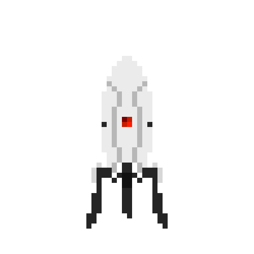

  

  
  
  

---

  

---

### :man_technologist: About Me :

My name Is Maximo and I am a future Full-Stack Developer  from Texas.

- :telescope: I’m currently working as an I.T Technician.

- :man_student: Currently attending UTSA Coding Bootcamp.

- :zap: In my free time, I continue my studies by practicing code.

---

### :fire: My Stats :

